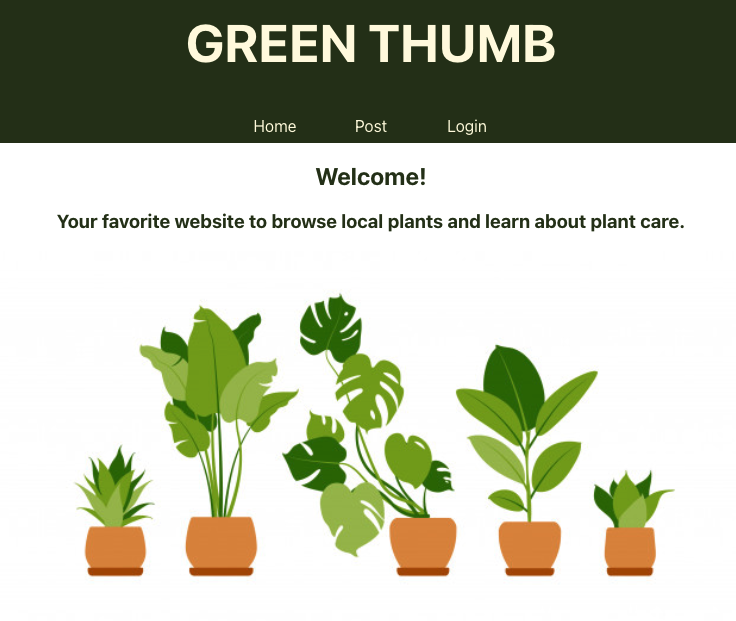

# GREEN-THUMB

## Table of Contents

- [Description](#description)
- [Homepage](#homepage)
- [Technologies](#technologies)
- [Installation](#installation)
- [Usage](#usage)
- [License](#license)
- [Contributing](#contributing)
- [Tests](#tests)
- [Questions](#questions)

## Description

    This project is a simple companion app with only what you need to know about plants you can grow.

    Motivation:
    we don’t know how to garden. Existing resources are intimidatingly over-detailed and don’t have social feedback.

    As a user I want to:
    find plants I can grow depending on the season and level of maintenance required.

## Homepage

## Technologies

    React, Express, Mongoose, Node, Heroku, GraphQL, JWT, PWA

## Installation

    Clone the project repository from GitHub and install all the dependencies using the command
        npm install
    Launch the react app locally at http://localhost:3001/ in your browser using the command
        npm start

## Usage

    The app is deployed and is live on Heroku @ https://tranquil-falls-18471.herokuapp.com/

## License

    This repository is licensed under the 'MIT License'.
    Refer to https://opensource.org/licenses/MIT for complete license terms.

## Contributing

    This project is not accepting contributions but if you send a pull request, it could be accepted under the license terms of the MIT license.

## Tests

    No tests included.

## Questions

For any questions about the project/repository contact the authors of the _Archivary_ team @  
[Archana Nagaraja](https://github.com/archana-nagaraj),
[Olivia Faraone](https://github.com/oliviafaraone),
[Hilary Richardson](https://github.com/hlry)   OR  
GitHub Repo @ [archivary/green-thumbs](https://github.com/Archivary/green-thumbs)
